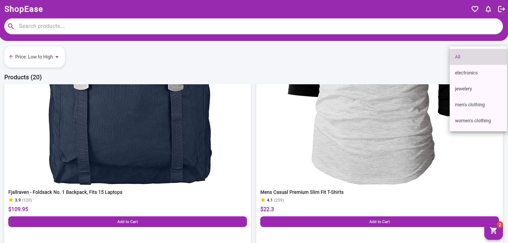
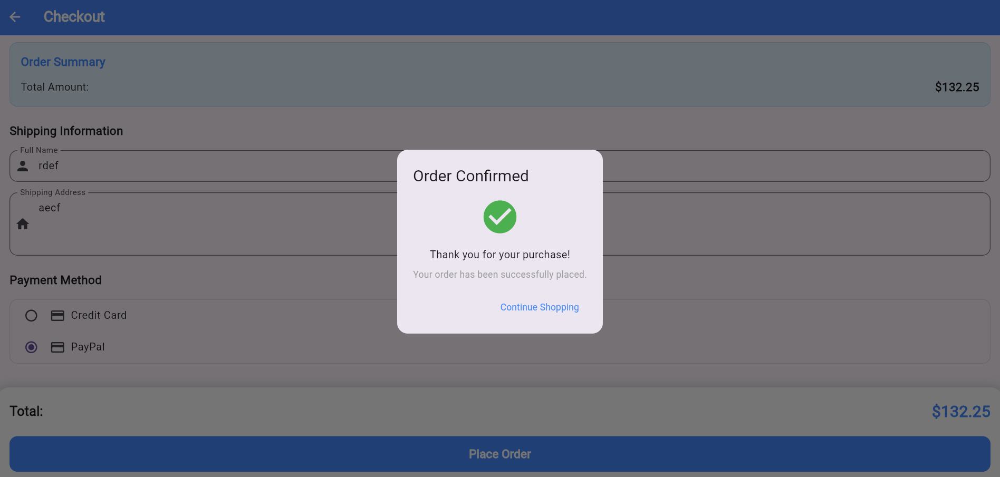
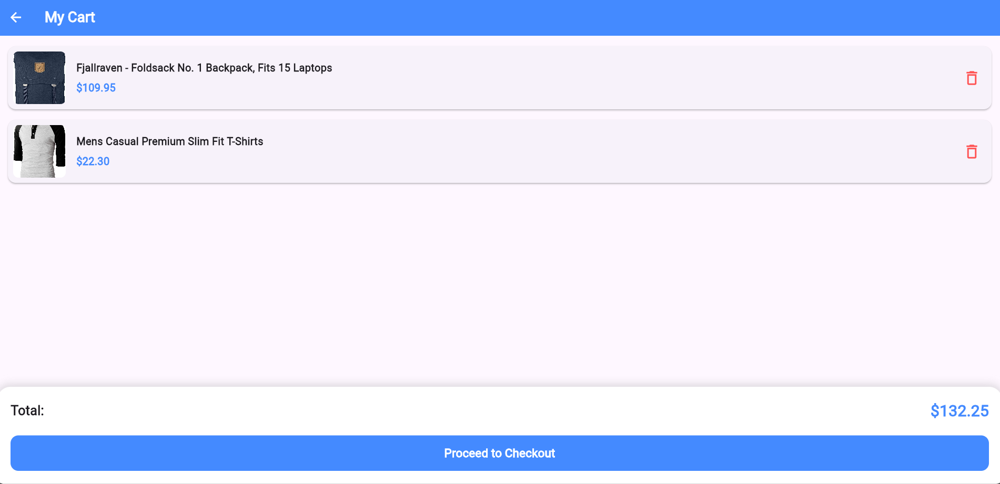

# 🛒 Flutter E-commerce App

🚀 A fully functional **E-commerce Web App** built with Flutter, offering a seamless shopping experience with a modern UI.


🔗 **Live Demo:** [Flutter App on GitHub Pages](https://i-am-bharathkumar.github.io/Flutter_App/)

---

## 📌 Features

✅ **Modern UI** with a responsive layout  
✅ **Product Listings** with images, prices & descriptions  
✅ **Shopping Cart** functionality  
✅ **Smooth Animations** and state management  
✅ **Secure Checkout & Payments**  
✅ **Mobile-friendly** and optimized for all devices  
✅ **GitHub Pages Deployment**  

---

## 🛠️ Tech Stack

| Technology  | Description |
|-------------|------------|
| **Flutter** | Cross-platform UI toolkit |
| **Dart**    | Programming language |
| **GitHub Pages** | Hosting for deployment |
| **Firebase** (Optional) | Authentication & Database |
| **REST API** (Optional) | Fetching product details |

---

## 🚀 Installation & Setup

Follow these steps to run the project locally:

### 1️⃣ Clone the Repository
```sh
git clone https://github.com/i-am-bharathkumar/Flutter_App.git
cd Flutter_App
```

### 2️⃣ Install Dependencies
```sh
flutter pub get
```

### 3️⃣ Run the App Locally
```sh
flutter run -d chrome
```

### 4️⃣ Build for Web Deployment
```sh
flutter build web --base-href="/Flutter_App/"
```

---

## 🌍 Deployment on GitHub Pages

1. **Enable GitHub Pages** from the repository settings.  
2. **Build the project** using:
   ```sh
   flutter build web --base-href="/Flutter_App/"
   ```
3. **Push the `build/web` folder** to the `gh-pages` branch:
   ```sh
   git add -A
   git commit -m "Deploying Flutter App"
   git push origin gh-pages
   ```
4. **Update GitHub Pages settings** to serve from the `gh-pages` branch.  
5. **Visit:** [https://i-am-bharathkumar.github.io/Flutter_App/](https://i-am-bharathkumar.github.io/Flutter_App/)

---

## 📸 Screenshots

| Home Page | CheckOut Page | Cart Page |
|-----------|-------------|----------|
|  |  |  |

---

## 🛠️ Future Improvements

- [ ] **User Authentication** (Google Sign-In & Firebase Auth)
- [ ] **Payment Gateway Integration** (creditcard, PayPal)
- [ ] **Backend API** for dynamic product updates
- [ ] **Wishlist & Order History** features

---

## 🤝 Contributing

1. **Fork** the repository  
2. **Create a new branch** (`feature/your-feature`)  
3. **Commit changes** (`git commit -m "Added new feature"`)  
4. **Push to GitHub** (`git push origin feature/your-feature`)  
5. **Submit a Pull Request** 🚀  

---

## 📜 License

This project is licensed under the **MIT License**.  
